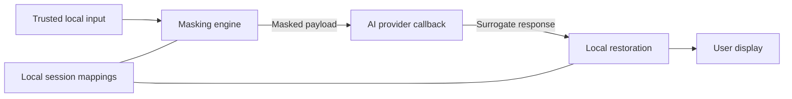

<div align="center">

# 🛡️ SecureMCP

**Local English/Korean Masking · Subscription Gateway · Trusted Restoration**

*영어·한국어·코드를 로컬에서 마스킹하고, 도구 실행과 사용자 화면에서 원문을 복원하는 개인정보 보호 도구*

[](pyproject.toml)
[](pyproject.toml)
[](.github/workflows/ci.yml)
[](https://github.com/mj10612/SecureMCP/actions/workflows/ci.yml)
[](docs/ARCHITECTURE.md)
[](LICENSE)

---

[English](#english-overview) · [한국어 안내](#한국어-안내-korean-overview) · [Supported Versions](#supported-versions) · [Quick Start](#quick-start) · [Features](#features) · [Architecture](#system-architecture) · [Documentation](#documentation)

---

</div>

## English Overview

**SecureMCP** masks English/Korean text and code locally, with session-based restoration.

Version 0.5 adds an experimental **local subscription gateway** for Claude Code and Codex.
Run `secure-mcp gateway install` once, then use `claude` / `codex` normally. Requests are
masked automatically; responses and local tool arguments are restored automatically. Existing
CLI subscription OAuth is forwarded to the original subscription service; API keys are refused.
No agent hooks are installed. See [subscription gateway](docs/GATEWAY.md) for setup,
automatic startup, tested versions and the exact protection boundary.

Legacy agent hooks remain optional utilities. They cover selected tool text rather than
complete requests; [local integration](docs/LOCAL_INTEGRATION.md) documents their limits.

Other hosts have explicit support levels in the [compatibility table](docs/COMPATIBILITY.md).
[Antigravity](docs/ANTIGRAVITY.md) provides verified stdio MCP utility integration;
SDK gateway authentication is currently blocked by SDK 0.1.20's header configuration limits.
The separate [xAI API mode and Grok custom model](docs/GROK.md) require opt-in and incur
API charges, independently of Claude/Codex or Grok subscriptions.

Mask confidential input **before** sending it to a provider. Restore responses in your trusted
local application and show them to the user there. Model-invoked MCP tool arguments are already
visible to the provider; adding this server to Claude Desktop or Cursor does not automatically
intercept or protect prompts. Restored originals must not be sent back into the model context.
This is heuristic masking, not a proof of anonymity, cryptographic zero knowledge, or regulatory compliance.

---

## Supported Versions

| Component | Supported versions / scope |
| :--- | :--- |
| SecureMCP | **0.5.1** |
| Python | **3.10 · 3.11 · 3.12 · 3.13 · 3.14** in CI; package requires Python ≥ 3.10 |
| Operating systems | **Windows · macOS · Linux** in CI |
| Claude Code gateway | **2.1.287 / Sonnet 5.5** native fixtures and live subscription file-read/masking/restoration verified in English and Korean |
| Codex gateway | **CLI 0.160.0 / gpt-6.1-sol** native fixtures and live ChatGPT subscription file-read/masking/restoration verified in English and Korean |
| MCP transport | Local **stdio**; CLI HTTP/SSE transports are disabled |
| Natural languages | **English · 한국어 · mixed input** |
| Code languages | Python · JavaScript · TypeScript · Go · Rust · Java · C · C++ · SQL |

The [CI matrix](.github/workflows/ci.yml) covers 15 Python/OS combinations. Code-language
support describes lexer modes, not compatibility with every language release or compiler.
The gateway is experimental. Native fixture tests verify routing/masking/restoration.
Both agents passed live subscription tests: native file reads, masked source transmission,
model answers and automatic restoration in English and Korean. Claude's attribution and
alias compatibility bugs are fixed. The earlier 429 was not subscription exhaustion.
This does not certify all-traffic privacy.

---

## Quick Start

### Automatic subscription integration

```bash
uv tool install .
secure-mcp gateway install
secure-mcp gateway status
```

Restart Claude Code/Codex and use their normal commands. Setup preserves login caches and
registers a hidden user-login startup task. It changes user-wide provider settings; no agent
hooks are added. Subscription limits still apply. This is text/code inference protection;
images, remote attachments and unsupported payloads are blocked. See [gateway guide](docs/GATEWAY.md).

### Legacy optional agent hooks

```bash
uv tool install .
secure-mcp init --agent claude
secure-mcp doctor
```

Restart Claude Code after installation. Hooks default to the current project; use `--global`
for user-wide registration. See [local integration](docs/LOCAL_INTEGRATION.md) for supported
tool fields, installation/removal and limitations.

For Codex:

```bash
secure-mcp init --agent codex
secure-mcp doctor --agent codex
```

Restart Codex and review/trust the installed definitions in `/hooks`. Project hooks require a
trusted project. Codex masks tool results and restores `Bash`/`apply_patch` inputs; automatic
screen restoration is unavailable. Use `secure-mcp restore --agent codex --session-id <id>`
with masked text on UTF-8 stdin for local display. See [Codex integration](docs/LOCAL_INTEGRATION.md#codex).

### Development installation and demo

```bash
uv venv
uv pip install -e ".[dev]"
uv run python -m secure_mcp demo
```

### Trusted local Python API

```python
from secure_mcp import LocalPrivacyClient

# Replace echo with your provider adapter. Only its argument may leave the host.
def provider(masked_payload: str) -> str:
    return masked_payload

with LocalPrivacyClient() as client:
    result = client.request(
        "Patient John Doe received 50mg.", provider,
        sensitive_terms={"John Doe"},
    )
    print(result.unmasked_text)  # Local display only
```

---

## Features

| Feature | Behavior |
| :--- | :--- |
| 🌐 English & Korean | Per-word multilingual handling, conservative Korean particle separation and explicit sensitive terms |
| 🧩 Code-aware masking | Language-specific lexer modes for identifiers, literals, numbers and comments |
| 🎭 Four surrogate strategies | Bracket, Unicode, delimited pseudoword and random hash representations |
| 🔁 Subscription gateway | Automatic request masking, shared prompt/code aliases, local tool-argument restoration and automatic answer display; existing OAuth, no API-key fallback |
| 🔌 Local agent hooks | Claude Code and Codex tool-text masking and local execution-argument restoration; Claude Code also supports display-only restoration |
| 🔐 Session management | Stable per-session mappings, operation locks, idle expiry and opt-in encrypted snapshots |
| 🛠️ CLI & Python API | Local masking/restoration, hook diagnostics, statistics and a buffered command wrapper |

### Masking policies

| Mode | Behavior |
| --- | --- |
| `content_words` | Mask content words and detected sensitive spans; keep functional grammar. |
| `entities_only` | Mask recognized PII, URLs, secrets, code spans, numbers and capitalized names. Korean and other case-free/non-ASCII words are masked conservatively, including ordinary nouns. |
| `aggressive` | Keep a small structural subset of articles/prepositions/conjunctions; mask auxiliaries, adverbs, pronouns and other words. |
| `code_aware` | Mask identifiers, numbers, literals and comments using the selected language lexer. |

English, Korean and mixed input are handled per word. Unicode names remain atomic. Korean
particle splitting uses known stems and conservative rules; unknown ambiguous words stay whole.
It is not a full morphological analyzer or universal person-name detector. Supply `sensitive_terms`
for domain names, lowercase names, ambiguous names, and custom secrets. `custom_preserve` / CLI
`--preserve` deliberately exempts selected words; recognized sensitive spans still take precedence.
Unknown secret formats and context-dependent names may evade `entities_only`; inspect the payload
or use broader masking. A high masking ratio does not prove absence of sensitive data.

### Surrogate strategies

| Strategy | Representation |
| :--- | :--- |
| `bracket` | `[ENT_1]` |
| `unicode` | `⟦ENT_1⟧` |
| `pseudoword` | Explicitly delimited pronounceable words, e.g. `⟪Brivel…⟫` |
| `hash` | Random 96-bit nonce, independent of the original |

Pseudowords use explicit delimiters
to avoid collisions with real words and adjacent tokens. Allocation is stable within a session;
random strategies intentionally differ between sessions. Keep all surrogate spelling intact.
Altered/unknown placeholder candidates are reported in `unmatched_surrogates`; `strict=True`
rejects them. Free-form deletion or invention by a model cannot always be detected or reconstructed.

### Korean restoration

Exact mask/unmask roundtrips keep written particles. For newly generated Korean responses,
opt into `normalize_particles=True` (CLI `--normalize-particles`) to choose 이/가, 은/는, 을/를,
과/와 and 으로/로 from a restored Hangul stem. Pronunciation of foreign names is not guessed.

### Code-aware review representations

Code languages: `python`, `javascript`, `typescript`, `go`, `rust`, `java`, `c`, `cpp`, `sql`.
Use explicit `language` in `mask_code` (CLI `--code-language`) for ambiguous snippets.
Auto detection is best effort. Keywords are language-specific; builtins and shadowed builtin
names are masked. Unicode identifiers, SQL comments/doubled quotes, backticks, Python f-strings
and escaped newlines, C++/Rust raw strings and numeric suffixes/separators are covered by tests.
Code allocations use ASCII names (`smcp_ID_n` and `smcp_LIT_n` inside literals)
and random native integer constants for numbers (reserved `732846` prefix plus 12 digits),
independently of the text strategy, so byte literals remain valid too. Python output
is syntax-checked in tests. Output is an opaque review representation: it need not execute,
type-check, retain numeric types/values, or preserve f-string/template interpolation behavior. This
small lexer is not a complete parser for every version of every supported language.

---

## System Architecture



The subscription gateway masks configured inference requests before forwarding them and
restores responses before the CLI consumes them. The callback path masks its provider argument.
Legacy agent hooks use a separate,
partial tool-text path; they do not intercept all outgoing context. See the
[architecture](docs/ARCHITECTURE.md) and [local integration](docs/LOCAL_INTEGRATION.md) documents.

---

## CLI and Sessions

```bash
python -m secure_mcp mask "Alice from Google" --session-id example --session-file example.enc --json-output
python -m secure_mcp unmask "[ENT_1] from [ENT_2]" --session-id example --session-file example.enc --strict
python -m secure_mcp mask "john doe" --mode entities_only --sensitive-term "john doe"
```

Use the same hidden password, or `SECURE_MCP_SESSION_PASSWORD`. CLI files use authenticated
Fernet encryption, random salt, PBKDF2-HMAC-SHA256 with 600,000 iterations, atomic writes and a
lock over the complete CLI read/modify/write operation. A concurrent writer fails clearly.
A crash may leave `example.enc.lock`; remove it only after confirming no writer is running.
Files are opt-in; without `--session-file`, mappings only survive in the current process.
Payload schema v2 stores allocations/counters without regenerating mappings. Legacy v1 files
remain readable; unknown schema versions fail explicitly. Delete session files after use.
Legacy bare pseudoword allocations retain their old ambiguity; start a new session to use
the safe delimited representation for every allocation.

Session strategies are immutable; `mode` records the last-used policy. Creating a duplicate ID
fails without changing its TTL or mappings. TTL must be positive and at most one day. The vault
sweeps idle expired sessions at most one cleanup interval later (default one second), and checks
expiration on access. Clear waits for active operations and invalidates retained references.
Library users must use `session.operation()` for custom mutations; built-in engine operations
use the same lock. `vault.close()` stops cleanup and releases all mapping references. Python
cannot promise byte-level memory zeroization. Standalone `PrivacySession` owners manage lifetime
themselves; use `SessionVault` for scheduled expiry.

`masked_ratio` counts masked token occurrences divided by non-whitespace/non-punctuation
occurrences. Deprecated `privacy_entropy_score` is an alias, not information entropy.
`restored_occurrences` counts replacements; `restored_unique_tokens` counts distinct allocations.
`restored_tokens_count` remains a compatibility alias for replacement occurrences.

---

## MCP Tools Reference

`python -m secure_mcp serve` supports local stdio only. HTTP/SSE transports are disabled in the CLI;
directly exposing the Python server over a network requires host-provided authentication and isolation.

| MCP tool | Purpose |
| :--- | :--- |
| `mask_text` | Mask text with a selected policy and session |
| `mask_code` | Create a code review representation using a selected language lexer |
| `create_privacy_session` | Create an isolated mapping session |
| `get_session_stats` | Return counters without original values or mapping entries |
| `clear_privacy_session` | Release the session's mapping references |

Local Python `unmask_text` / `unmask_code` and CLI `unmask` are **not registered as MCP tools**,
so a model cannot enumerate mappings via restoration. Resources: `privacy://policies`, `privacy://status`.
Example desktop configurations are utility setups, not privacy proxies.

### Migration from 0.1

Version 0.2 changes pseudoword delimiters, code identifier/number representations, mapping keys
(`mapping_key(original, token_type, code=...)`), sentence-initial entity classification, keyword
preservation, and the MCP restoration boundary. Direct store readers should use mapping values
or `mapping_key`. Validate explicitly requested strategies; omitted strategies follow the generator.

---

## 한국어 안내 (Korean Overview)

0.5에서는 **Claude Code·Codex의 기존 구독 로그인을 유지하는 로컬 게이트웨이**를 제공합니다.
`uv tool install .` 설치 후 `secure-mcp gateway install`을 **한 번** 실행하고 두 CLI를 재시작하세요.
그 뒤에는 평소처럼 `claude` / `codex`를 사용하면 됩니다. 직접 입력·텍스트 코드·도구 결과를 자동으로
마스킹하고, 답변과 로컬 실행 인자는 자동 복원합니다. 함수명·변수명·문자열·숫자·주석을 보존하는
예외는 추가하지 않았습니다. 입력에서 지칭한 함수와 코드의 함수는 같은 치환표를 사용합니다.

기존 로그인 파일은 읽거나 복사하지 않습니다. CLI가 관리하는 OAuth 헤더와 갱신 흐름을 사용하고,
API 키 요청은 거부하므로 유료 API로 자동 전환하지 않습니다. 새 Hook을 등록하지 않으며,
운영체제 사용자 로그인 시 백그라운드로 자동 시작하도록 설정합니다. 기존 Hook 방식은 선택 기능으로
남겨 두었습니다. [설치·해제 및 보호 범위](docs/GATEWAY.md)를 확인하세요.

Claude Code 2.1.287·Codex 0.160.0의 실제 CLI를 모의 OAuth/로컬 서버로 검증했습니다.
두 CLI 모두 기존 구독 로그인으로 영어·한국어 질문 → 실제 파일 읽기 → 코드 마스킹 전송 → 정상 답변·자동 복원까지 검증했습니다. Claude의 식별 블록·치환명 호환 오류를 수정했으며, 기존 429는 구독 한도 소진이 아니었습니다. 이미지·원격 첨부·미지원 요청은 차단하고,
게이트웨이 밖의 도구 네트워크·텔레메트리까지 보호한다고 주장하지 않습니다.

SecureMCP는 영어·한국어·혼합 문장을 로컬에서 마스킹하고 복원합니다. 클라우드에 요청하기
**전에** `LocalPrivacyClient` 또는 로컬 API/CLI로 원문을 가리고, 응답은 로컬에서만 복원하세요.
모델이 호출하는 MCP 도구의 인자는 이미 제공자에게 전달되어 있으므로, Claude Desktop/Cursor에
서버를 추가하는 것만으로 개인정보가 보호되지는 않습니다. 복원한 원문을 모델 컨텍스트에 다시
넣으면 안 됩니다. MCP 복원 도구는 제거했으며, 기본 CLI 서버는 로컬 stdio만 지원합니다.

영어 대문자 이름과 Unicode 이름을 하나의 토큰으로 처리합니다. 한국어 이름과 일반 명사가
구분되지 않는 `entities_only`에서는 비기능어를 보수적으로 가립니다. 조사 분리는 알려진 어간과
보수적인 규칙을 사용하며, 모호한 미등록 단어는 통째로 가립니다. 모든 고유명사·비밀값 또는
한국어 형태소를 완벽히 인식하는 도구는 아닙니다. `sensitive_terms` / `--sensitive-term`으로
특정 용어를 지정하고, 알 수 없는 민감정보에는 더 넓은 마스킹 정책을 사용하세요.

정확한 왕복 복원에서는 입력 조사를 그대로 유지합니다. 모델이 새로 만든 문장에는
`normalize_particles=True` / `--normalize-particles`를 선택하여 받침에 맞는 조사를 보정할 수
있습니다. 영어 이름·약어의 발음은 추측하지 않습니다. `--strict`는 탐지한 변형·미등록
플레이스홀더의 복원을 거부하지만, 모델이 완전히 삭제한 내용을 재구성하지는 못합니다.

세션 전략은 생성 후 고정되며, 중복 ID 생성은 오류입니다. 만료 세션은 주기적으로 정리하고,
삭제와 진행 중 작업을 잠금으로 조율합니다. 별도 CLI 프로세스 간 복원에는 동일한 암호화
`--session-file`이 필요합니다. 마스킹 비율은 통계이며 기밀성·익명성·규제 준수의 증명이 아닙니다.

---

## Development

```bash
python -m ruff check src tests examples
python -m mypy src
python -m pytest -W error --cov=secure_mcp --cov-report=term-missing --cov-fail-under=85
```

---

## Documentation

- [Subscription Gateway / 구독 로그인 자동 연동](docs/GATEWAY.md)
- [Host Compatibility and Shared Contract / 호스트 호환성](docs/COMPATIBILITY.md)
- [Legacy Local Claude Code & Codex Integration / 기존 Hook 안내](docs/LOCAL_INTEGRATION.md)
- [System Architecture](docs/ARCHITECTURE.md)
- [Issue Resolution and Review Notes](docs/ISSUE_RESOLUTION.md)
- [Contributing Guidelines](CONTRIBUTING.md)

## License

Licensed under **Apache License 2.0**. See [LICENSE](LICENSE) for details.
