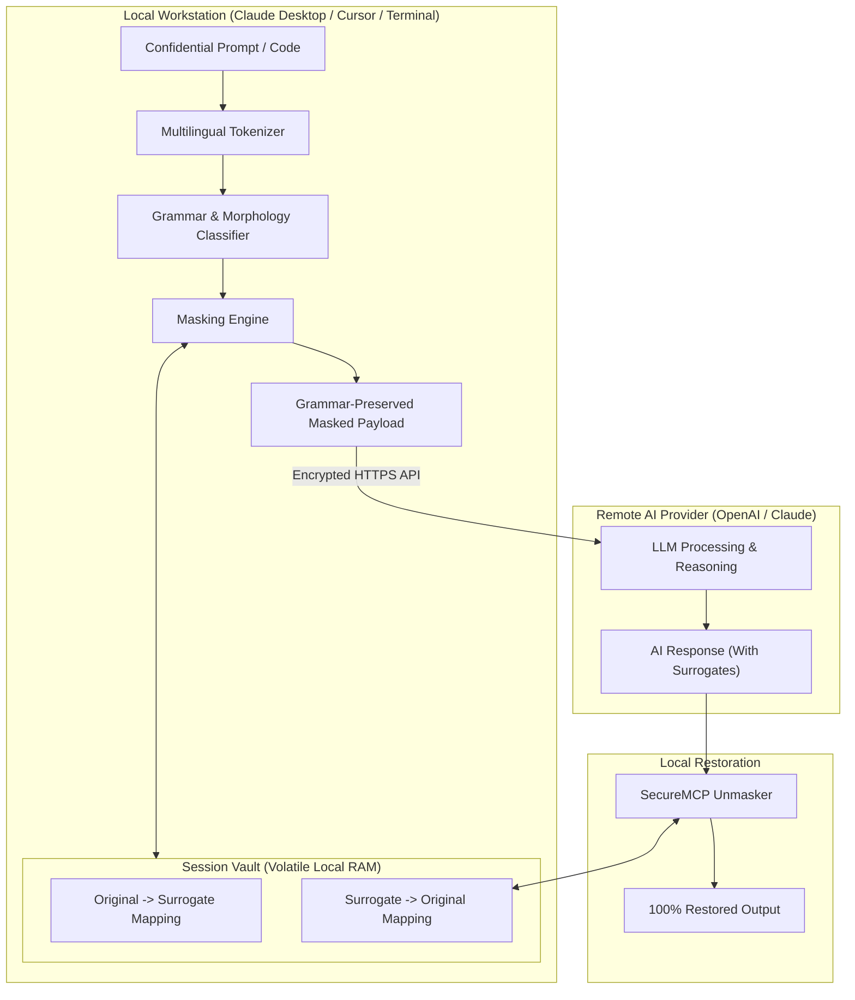

<div align="center">

# 🛡️ SecureMCP

**Grammar-Preserving Zero-Knowledge Semantic Masking & Anonymization MCP Server for LLMs**

*문법과 구문 구조는 그대로 유지하고, 민감한 내용어와 엔티티만 의미 없는 인공 토큰으로 변환하여 안전하게 AI 추론을 수행한 뒤 로컬에서 100% 복원해주는 Model Context Protocol(MCP) 서버*

[](https://opensource.org/licenses/Apache-2.0)
[](https://python.org)
[-orange.svg)](https://modelcontextprotocol.io)
[]()
[]()

---

[English](#english-overview) | [한국어 안내](#한국어-안내-korean-overview) | [OpenAI & Claude Sponsorship](#openai--anthropic-claude-oss-sponsorship-alignment) | [Architecture](#system-architecture) | [Quick Start](#quick-start)

---

</div>

## English Overview

**SecureMCP** is a privacy-first [Model Context Protocol (MCP)](https://modelcontextprotocol.io) server engineered to eliminate data leakage risks when querying Large Language Models such as **OpenAI (GPT-4o, o1, o3)** and **Anthropic (Claude 3.5 Sonnet, Claude Opus)**.

### The Problem
When enterprises, medical institutions, legal teams, and developers interact with cloud LLMs, sending proprietary source code, patient health information (PHI), or corporate confidential data violates compliance standards (**GDPR, HIPAA, SOC 2, EU AI Act**). Naive redaction (`[REDACTED]`, `***`) destroys semantic bindings and syntax, causing the LLM to hallucinate or fail relational reasoning.

### The Solution: Grammar-Preserving Isomorphic Token Masking
SecureMCP runs entirely locally on your workstation. It:
1. **Preserves the Grammatical & Syntactic Backbone:** Closed-class function words (prepositions, conjunctions, pronouns, auxiliary verbs, punctuation) and code keywords (`def`, `return`, `class`, `SELECT`, `WHERE`) remain untouched.
2. **Decomposes Agglutinative Morphology (e.g., Korean):** Separates substantive roots from grammatical particles (조사: `-이/가`, `-은/는`, `-을/를`, `-에게`, `-로부터`) and verbal endings (`-입니다`, `-하고`), allowing the AI to understand semantic roles without knowing proprietary terms.
3. **Replaces Sensitive Content with Synthetic Surrogates:** Entities, proprietary nouns, and secrets map to deterministic placeholders (`[ENT_1]`, `⟦ORG_1⟧`, or natural pseudowords like `Brivon`).
4. **Restores Original Text Client-Side:** When the AI model responds referring to the surrogate tokens, SecureMCP locally reconstructs the exact original entities with **100.0% roundtrip fidelity**.

---

## 한국어 안내 (Korean Overview)

**SecureMCP**는 OpenAI와 Anthropic의 최신 LLM(GPT-4o, Claude 3.5 등)에 데이터를 전송할 때, **기밀 유출을 방지하기 위한 제로-놀리지(Zero-Knowledge) 의미 난독화 및 복원 MCP 서버**입니다.

### 핵심 동작 원리
1. **문법 및 구문 구조의 완벽한 보존:**
   접속사, 기능부사, 문법 요소 및 프로그래밍 언어의 제어 구문(`if`, `for`, `def`, `class`, `SELECT`)은 그대로 유지합니다.
2. **한국어 교착어 특화 형태소 분리(체언 + 조사 분리):**
   - 원문: `"삼성전자가 카카오와 협력하여 신규 보안 AI 솔루션을 개발했습니다."`
   - 난독화 전송: `"[ENT_1]가 [ENT_2]와 [NOUN_1]하여 [NOUN_2] [NOUN_3] [ENT_3] [NOUN_4]을 [NOUN_5]했습니다."`
   - AI 응답: `"[ENT_1]와 [ENT_2] 간의 [NOUN_4] 개발 협력은 [NOUN_3] 분야의 획기적인 발전입니다."`
   - 로컬 복원: `"삼성전자와 카카오 간의 솔루션 개발 협력은 AI 분야의 획기적인 발전입니다."`
   - **조사(`가`, `와`, `을`, `의`)가 정확히 유지**되므로 AI는 주어와 목적어의 논리적 관계를 완벽히 이해하면서도 실제 기업명이나 프로젝트명은 전혀 알 수 없습니다.
3. **로컬 메모리 기반 보안 (Zero-Cloud Storage):**
   치환 테이블은 사용자의 로컬 RAM에만 임시 보관되며 네트워크로 절대 유출되지 않습니다. 세션 종료 시 즉시 영구 삭제(Zero-Trace Wipe)됩니다.

---

## OpenAI & Anthropic Claude OSS Sponsorship Alignment

SecureMCP has been specifically designed to qualify for the **OpenAI Open Source Software (OSS) Sponsorship Program** and the **Anthropic / Claude Open Source Maintainer Support Program**:

| Program | Strategic Value of SecureMCP |
| :--- | :--- |
| **OpenAI OSS Sponsorship** | Unlocks enterprise and regulated-industry adoption of OpenAI API models (GPT-4o, o1, o3) without violating HIPAA, GDPR, or trade secret covenants. Validates zero-hallucination prompting techniques. |
| **Anthropic Claude OSS Program** | Built native on Anthropic's **Model Context Protocol (MCP)** specification. Provides immediate zero-configuration privacy for **Claude Desktop** and **Cursor**, reinforcing Anthropic's mission of AI Safety and Constitutional AI. |

> Detailed grant and sponsorship proposal available in [docs/OSS_SPONSORSHIP.md](docs/OSS_SPONSORSHIP.md).

---

## System Architecture



---

## Features

- **Multilingual Support:** Native English closed-class preservation & Korean agglutinative particle (`조사`) separation.
- **Code-Aware Masking:** Preserves AST structure, indentation, and keywords for **Python, JavaScript, TypeScript, Go, Rust, Java, C++, and SQL**. Obfuscates variable names, function names, and secrets.
- **4 Surrogate Strategies:**
  - `bracket`: Explicit tags like `[ENT_1]`, `[NUM_1]`, `[ID_1]`.
  - `unicode`: Mathematical delimiters `⟦ENT_1⟧` preventing BPE sub-token splitting.
  - `pseudoword`: Natural pronounceable nonce words (`Brivon`, `Cranley`, `Velmor`) maintaining smooth perplexity.
  - `hash`: Compact salted nonces `~h1_8f3a~`.
- **4 Masking Modes:**
  - `content_words`: Masks content nouns, entities, numbers; preserves functional grammar.
  - `entities_only`: Masks only PII, emails, phone numbers, IPs, secrets, numbers, and proper nouns.
  - `code_aware`: Masks code identifiers and string literals while keeping language keywords.
  - `aggressive`: Masks all tokens except essential structural prepositions/conjunctions.
- **Extreme Speed:** >240,000 words/sec masking throughput, >4,000,000 words/sec restoration throughput.
- **Zero Dependencies for Core Logic:** Pure Python algorithmic parsing with standard library regex.

---

## Quick Start

### Installation

```bash
# Using uv (fastest)
uv pip install secure-mcp

# Or standard pip
pip install secure-mcp
```

### 1. Claude Desktop Setup

Add SecureMCP to your Claude Desktop configuration file:
- **macOS:** `~/Library/Application Support/Claude/claude_desktop_config.json`
- **Windows:** `%APPDATA%\Claude\claude_desktop_config.json`

```json
{
  "mcpServers": {
    "secure-mcp": {
      "command": "uvx",
      "args": ["secure-mcp", "serve"]
    }
  }
}
```

### 2. Cursor IDE Setup

In Cursor settings (`Features -> MCP Servers`), add:
- **Name:** `secure-mcp`
- **Type:** `command`
- **Command:** `uvx secure-mcp serve`

---

## Interactive CLI Demo & Benchmark

### Mask and restore in separate CLI processes

MCP sessions remain in memory. To restore text in a separate CLI invocation,
explicitly opt in to a password-encrypted local session file:

```bash
python -m secure_mcp mask "Alice from Google" --session-id example --session-file example.enc
python -m secure_mcp unmask "[NOUN_1] from [ENT_1]" --session-id example --session-file example.enc
```

Both commands prompt for the same password without displaying it. For automation,
set `SECURE_MCP_SESSION_PASSWORD` in the process environment. Files use authenticated
Fernet encryption with a random salt and PBKDF2-HMAC-SHA256 (600,000 iterations);
plaintext mappings are never written to disk. Delete the encrypted file after use.
Files expire after one hour of inactivity, and loading an expired file is rejected.
Use each file sequentially; concurrent CLI writers to the same file are unsupported.
Without `--session-file`, CLI mappings exist only for the current process.

A session's surrogate strategy is fixed when it is created. Reusing the same
session with another strategy returns an error; use a new session ID/file instead.
Unmasking infers the strategy from the session when `--strategy` is omitted.
The `entities_only` mode conservatively masks capitalized non-function words,
including sentence-initial words, so it may mask ordinary capitalized nouns too.

Experience grammar-preserving obfuscation and local restoration in your terminal:

```bash
# Run interactive live demonstration (English, Korean, Code)
python -m secure_mcp demo

# Run performance and entropy benchmark
python -m secure_mcp benchmark
```

### Benchmark Results

```
                      Benchmark Results                      
┏━━━━━━━━━━━━━━━━━━━━━━━━━━━━━━━━┳━━━━━━━━━━━━━━━━━━━━━━━━━━┓
┃ Benchmark Metric               ┃ Value                    ┃
┡━━━━━━━━━━━━━━━━━━━━━━━━━━━━━━━━╇━━━━━━━━━━━━━━━━━━━━━━━━━━┩
│ Total Words Processed          │ 1,601 words              │
│ Masking Time                   │ 6.49 ms                  │
│ Masking Speed                  │ 246,615 words/sec        │
│ Unmasking Time                 │ 0.38 ms                  │
│ Unmasking Speed                │ 4,171,443 words/sec      │
│ Privacy Obfuscation Ratio      │ 81.8%                    │
│ Roundtrip Restoration Accuracy │ 100.0% (Zero Divergence) │
└────────────────────────────────┴──────────────────────────┘
```

---

## MCP Tools Reference

SecureMCP exposes the following standard MCP tools to AI clients:

| Tool | Parameters | Description |
| :--- | :--- | :--- |
| `mask_text` | `text`, `session_id`, `mode`, `strategy`, `language` | Obfuscates content words while preserving syntax and grammar. |
| `unmask_text` | `masked_text`, `session_id`, `strategy` | Restores original text from AI responses containing surrogate tokens. |
| `mask_code` | `code`, `session_id`, `strategy` | Obfuscates code identifiers, functions, and string literals. |
| `unmask_code` | `masked_code`, `session_id`, `strategy` | Restores original code symbols from LLM refactored output. |
| `create_privacy_session` | `session_id`, `mode`, `strategy`, `ttl_seconds` | Creates an isolated session with custom TTL and encryption salt. |
| `get_session_stats` | `session_id` | Returns privacy metrics without disclosing sensitive raw tokens. |
| `clear_privacy_session` | `session_id` | Triggers a zero-trace memory wipe for the specified session. |

### MCP Prompts

- `privacy_preserving_assistant`: Ready-to-use system instructions directing LLMs how to reason over surrogate tokens without altering placeholders.
- `secure_code_assistant`: Instructs models to perform refactoring and optimization on obfuscated code.

### MCP Resources

- `privacy://policies`: Machine-readable specification of supported policies, strategies, and grammar rules.
- `privacy://status`: Real-time operational status and active session count.

---

## Python API Integration Examples

### OpenAI GPT-4o Privacy Pipeline

```python
from secure_mcp import MaskingEngine, SessionVault, MaskMode, SurrogateStrategy

vault = SessionVault()
engine = MaskingEngine()
session = vault.get_or_create("openai_session", mode=MaskMode.CONTENT_WORDS)

# 1. Mask prompt locally before sending to OpenAI
raw_prompt = "Patient John Doe was diagnosed with acute lymphoblastic leukemia at St. Jude Hospital."
mask_result = engine.mask_text(raw_prompt, session.session_id, session.generator, session.forward_store, session.reverse_store)

# 2. Transmit masked_text to OpenAI API (Zero PII transmitted)
# response = openai.chat.completions.create(model="gpt-4o", messages=[{"role": "user", "content": mask_result.masked_text}])
ai_response = "Summary: [NOUN_1] [ENT_1] is receiving treatment for [NOUN_4] [NOUN_5] at [ENT_2]."

# 3. Restore on local client
unmasked_result = engine.unmask(ai_response, session.session_id, session.reverse_store)
print(unmasked_result.unmasked_text)
# Output: "Summary: Patient John Doe is receiving treatment for acute lymphoblastic leukemia at St. Jude Hospital."
```

---

## Documentation

- [System Architecture](docs/ARCHITECTURE.md)
- [OpenAI & Claude Sponsorship Proposal](docs/OSS_SPONSORSHIP.md)
- [Contributing Guidelines](CONTRIBUTING.md)

---

## License

This project is licensed under the **Apache License 2.0** - see the [LICENSE](LICENSE) file for details.

Copyright (c) 2025-2026 SecureMCP Contributors.
