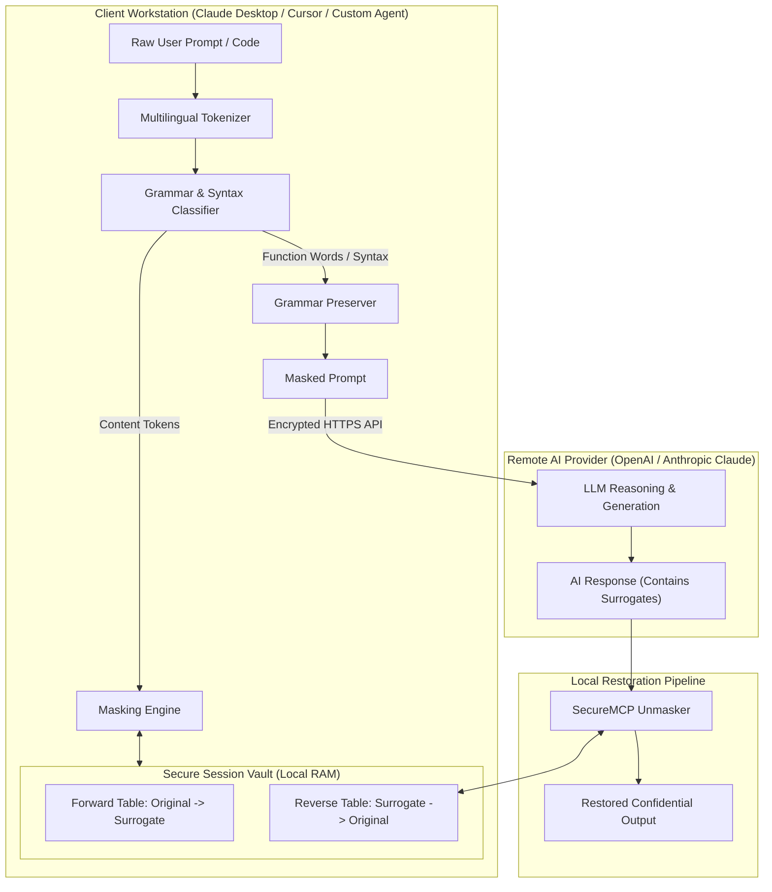
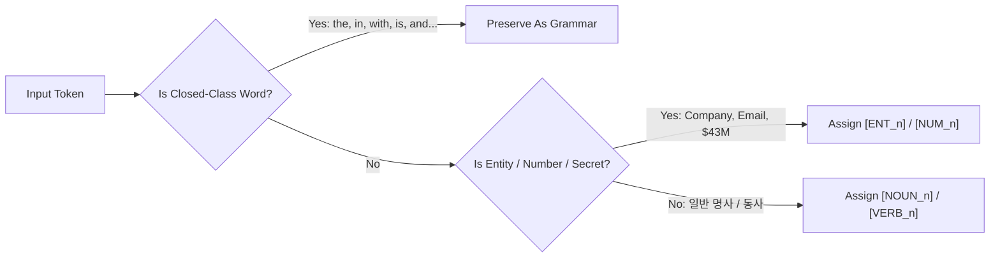
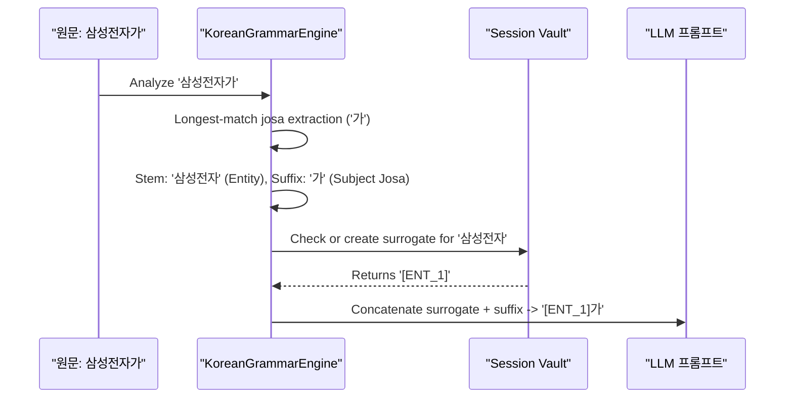

# SecureMCP Technical Architecture

SecureMCP operates as an intelligent local proxy implementing the Model Context Protocol (MCP). It intercepts text and code prompts before they are dispatched to remote AI endpoints, obscuring sensitive semantic tokens while preserving the grammatical and syntactic backbone.

---

## 1. High-Level System Architecture

---

## 2. Linguistic Decomposition Pipeline

### English Syntax Separation

### Korean Agglutinative Morphology Engine (교착어 형태소 분리)
In Korean, words (어절) bind substantive stems (체언) with grammatical particles (조사) and endings (어미):

$$\text{어절} = \text{체언 (실질 형태소)} + \text{조사 (형식 형태소)}$$

---

## 3. Code-Aware Obfuscation AST Engine

When processing source code (Python, TypeScript, SQL, Rust, Go, Java, C++):
- **Preserved Unchanged:**
  - Control keywords: `def`, `class`, `function`, `return`, `if`, `else`, `async`, `await`, `SELECT`, `WHERE`, `JOIN`
  - Built-in runtime symbols: `len`, `range`, `print`, `console.log`, `JSON.stringify`
  - Operators & syntax: `{}`, `()`, `[]`, `=>`, `+`, `-`, `*`, `;`, `:`, `.`
  - Indentation, newlines, and code structural geometry.
- **Obfuscated:**
  - Function / Method identifiers $\to$ `[ID_1]`
  - Variable / Parameter identifiers $\to$ `[ID_2]`
  - String literals $\to$ `"[LIT_1]"`
  - Numeric constants $\to$ `[NUM_1]`

---

## 4. Security & Privacy Guarantees

1. **Zero Cloud Disclosures:** No original tokens, mapping entries, or session metadata ever leave the local host.
2. **Volatile Memory Storage:** Mappings reside in Python process memory and are purged upon session termination or TTL expiration.
3. **No External Network Dependencies:** SecureMCP requires no internet access to perform tokenization, grammar parsing, or masking.
