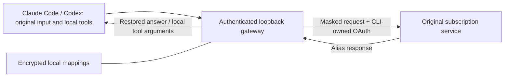
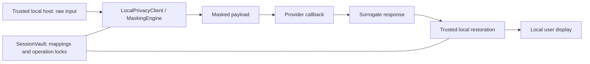

# Architecture and trust boundary

Version 0.5 adds an authenticated loopback subscription gateway. `gateway.py` owns request
masking, shared code/prompt allocations, strict JSON/SSE restoration, CLI OAuth forwarding
and encrypted restart state. `gateway_install.py` owns reversible user settings changes and
OS-login startup; it installs no agent hooks and does not load auth caches.
[Gateway integration](GATEWAY.md) describes supported protocols and uncovered traffic.

Legacy opt-in local Claude Code and Codex hook paths remain available. `hooks.py` owns settings merges,
encrypted cross-process snapshots, schema-preserving tool text masking, local argument restoration,
Claude display-only restoration and session-end cleanup. Codex feedback replacement and local
`Bash`/`apply_patch` input restoration use a separate adapter, with isolated encrypted state.
`cli.py` exposes `init`, `doctor`, `uninstall`, `stats`, `exec`, local stdin `restore` and the
private JSON hook entry point. The legacy hook path does not redirect provider endpoints.
This is a partial tool-text boundary: the trusted callback architecture below still applies to
full request protection. [Local integration](LOCAL_INTEGRATION.md) documents uncovered prompt,
attachment, telemetry and host failure paths; registration is not a privacy guarantee.

Only the callback argument crosses the provider boundary. The restored response is returned to
the trusted host, never to an MCP tool result. MCP utilities are useful for already-public data;
they do not intercept the host's outgoing prompts. The CLI refuses unauthenticated network transports.

The tokenizer recognizes sensitive spans before splitting Unicode words. Modes determine whether
content/function words are masked. English names use case heuristics; Korean and case-free names
use conservative masking and explicit sensitive terms. Korean suffixes require stem evidence;
ambiguous unknown words remain whole. No universal named entity or morphology guarantee is made.

Code uses a small lexer with per-language keywords and opaque literal/comment bodies. Explicit
language selection is preferable to heuristic detection. Code names and numeric expressions become
`smcp_ID_n`/`smcp_LIT_n` and random native integer constants; they preserve review syntax,
not execution or type semantics.

Mappings are keyed by context, type and original value. Restoration uses one substitution pass,
so inserted originals cannot be restored a second time. Explicit delimiters disambiguate pseudowords.
Unknown/altered candidates are reported and rejected in strict mode; arbitrary model edits are not
recoverable. Korean allomorph normalization is a separate opt-in operation for generated text.

Every engine allocation uses the generator's reentrant operation lock. Session clear acquires the
same lock, waits for work and invalidates future operations. The vault lock protects the registry;
lock order is vault then session. A daemon sweep releases idle expired mappings within the cleanup
interval. Close stops the worker and clears references. Custom library store mutations require
`session.operation()`. Clearing references is not physical memory zeroization.

CLI transfer is opt-in authenticated encryption with random salt and a password KDF. Schema v2
persists mappings and allocation counters without re-running the generator. Legacy v1 is read;
unknown versions fail explicitly. A CLI transaction holds an exclusive lock file from load to save.
Concurrent writes fail, atomic replacement prevents partial snapshots, and stale locks require
operator inspection after a crash. Caller-owned standalone sessions have caller-owned lifetime.
